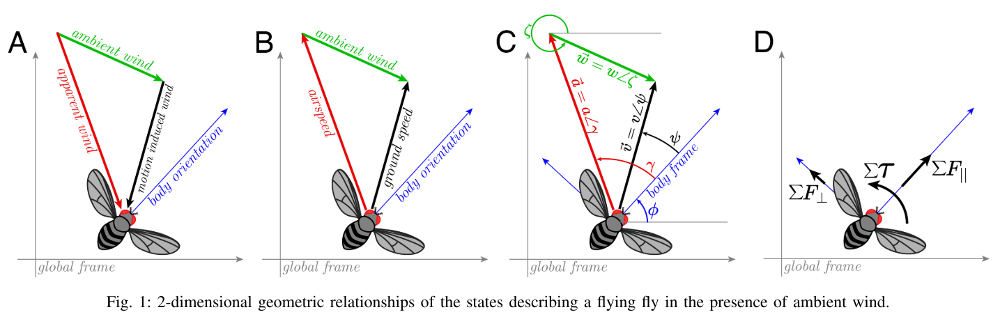

# fly-wind-simulator

This repository contains code to simulate the real-time dynamics of a fly, or other similar flying system, flying in a windy environment. The core simulation code is contained in <code>simulator.py</code> in the <code>code</code> directory. Example simulations are provided as jupyter notebooks in the <code>notebooks</code> directory.

The simulation is based off of the dynamical model presented in: https://ieeexplore.ieee.org/document/9683219/

